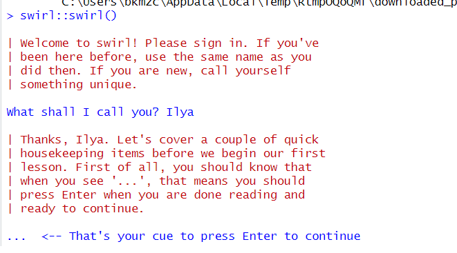

 # Подготовка воспроизводимых отчетов 
 
 
 ## Цель работы 
 
  Развить практические навыки использования современного стека воспроизводимых исследований и закрепить знания о современных сетевых протоколах прикладного уровня 
  
 ## Исходные данные 
 
 1. Программное обеспечение Windows 10 Pro
 2. Rstudio Desktop
 3. Интерпретатор языка R 4.1
 
 
 ## План 
 
 1. Подготовка программного обеспечения
 2. Формирование отчета с использованием стека технологий Rmarkdown и Quatro 
 3. Прикрепление результатов на сервисе Gitlab 
 
 ##Шаги 
 
 1. Установка R и настольной версии RStudio
 
 
 
 2. Установка настольной версии GitHub и создание рабочей публичной директории 
 
 