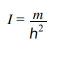

# Основы обработки данных с помощью R и Dplyr
chirkov.ilya4@yandex.ru

# Основы обработки данных с помощью R и Dplyr

## Цель работы

1.  Развить практические навыки использования языка программирования R
    для обработки данных
2.  Закрепить знания базовых типов данных языка R
3.  Развить практические навыки использования функций обработки данных
    пакета dplyr – функции select(), filter(), mutate(), arrange(),
    group_by()

## Исходные данные

1.  Программное обеспечение Windows 10
2.  Rstudio Desktop и библиотека Dplyr
3.  Интерпретатор языка R 4.1
4.  пакет dplyr

## Ход работы

1.  Установка программного пакета dplyr.

    ``` r
    install.packages("dplyr")
    ```

2.  Загрузка библиотеки

    ::: {.cell}

    ``` r
    library("dplyr")
    ```

    ::: {.cell-output .cell-output-stderr}


        Присоединяю пакет: 'dplyr'

    :::

    ::: {.cell-output .cell-output-stderr}

        Следующие объекты скрыты от 'package:stats':

            filter, lag

    :::

    ::: {.cell-output .cell-output-stderr}

        Следующие объекты скрыты от 'package:base':

            intersect, setdiff, setequal, union

    ::: :::

3.  Сколько строк в датафрейме?

``` r
starwars %>% nrow()
```

    [1] 87

1.  Сколько столбцов в датафрейме?

    ::: {.cell}

    ``` r
      starwars %>% ncol()
    ```

    ::: {.cell-output .cell-output-stdout}

        [1] 14

    ::: :::

2.  Как посмотреть примерный вид датафрейма?

<!-- -->

    ::: {.cell}

    ```{.r .cell-code}
      starwars %>% glimpse()
    ```

    ::: {.cell-output .cell-output-stdout}

    ```
    Rows: 87
    Columns: 14
    $ name       <chr> "Luke Skywalker", "C-3PO", "R2-D2", "Darth Vader", "Leia Or…
    $ height     <int> 172, 167, 96, 202, 150, 178, 165, 97, 183, 182, 188, 180, 2…
    $ mass       <dbl> 77.0, 75.0, 32.0, 136.0, 49.0, 120.0, 75.0, 32.0, 84.0, 77.…
    $ hair_color <chr> "blond", NA, NA, "none", "brown", "brown, grey", "brown", N…
    $ skin_color <chr> "fair", "gold", "white, blue", "white", "light", "light", "…
    $ eye_color  <chr> "blue", "yellow", "red", "yellow", "brown", "blue", "blue",…
    $ birth_year <dbl> 19.0, 112.0, 33.0, 41.9, 19.0, 52.0, 47.0, NA, 24.0, 57.0, …
    $ sex        <chr> "male", "none", "none", "male", "female", "male", "female",…
    $ gender     <chr> "masculine", "masculine", "masculine", "masculine", "femini…
    $ homeworld  <chr> "Tatooine", "Tatooine", "Naboo", "Tatooine", "Alderaan", "T…
    $ species    <chr> "Human", "Droid", "Droid", "Human", "Human", "Human", "Huma…
    $ films      <list> <"A New Hope", "The Empire Strikes Back", "Return of the J…
    $ vehicles   <list> <"Snowspeeder", "Imperial Speeder Bike">, <>, <>, <>, "Imp…
    $ starships  <list> <"X-wing", "Imperial shuttle">, <>, <>, "TIE Advanced x1",…
    ```


    :::
    :::

1.  Сколько уникальных рас персонажей (species) представлено в данных?

``` r
starwars %>% distinct(species) %>% nrow()
```

    [1] 38

1.  Найти самого высокого персонажа.

``` r
starwars %>% filter(is.na(height) == FALSE) %>% slice_max(height) %>% select(name,height)
```

    # A tibble: 1 × 2
      name        height
      <chr>        <int>
    1 Yarael Poof    264

1.  Найти всех персонажей ниже 170

``` r
starwars %>% filter(height < 170) %>% select(name,height)
```

    # A tibble: 22 × 2
       name                  height
       <chr>                  <int>
     1 C-3PO                    167
     2 R2-D2                     96
     3 Leia Organa              150
     4 Beru Whitesun Lars       165
     5 R5-D4                     97
     6 Yoda                      66
     7 Mon Mothma               150
     8 Wicket Systri Warrick     88
     9 Nien Nunb                160
    10 Watto                    137
    # ℹ 12 more rows

1.  Подсчитать ИМТ (индекс массы тела) для всех персонажей. ИМТ
    подсчитать по формуле



``` r
print(starwars %>% mutate(imt = mass / (height)^2) %>% select(name, imt))
```

    # A tibble: 87 × 2
       name                   imt
       <chr>                <dbl>
     1 Luke Skywalker     0.00260
     2 C-3PO              0.00269
     3 R2-D2              0.00347
     4 Darth Vader        0.00333
     5 Leia Organa        0.00218
     6 Owen Lars          0.00379
     7 Beru Whitesun Lars 0.00275
     8 R5-D4              0.00340
     9 Biggs Darklighter  0.00251
    10 Obi-Wan Kenobi     0.00232
    # ℹ 77 more rows

1.  Найти 10 самых “вытянутых” персонажей. “Вытянутость” оценить по
    отношению массы (mass) к росту (height) персонажей.

``` r
starwars %>% mutate(v = mass/height) %>% select(name,v) %>% head(.,10)
```

    # A tibble: 10 × 2
       name                   v
       <chr>              <dbl>
     1 Luke Skywalker     0.448
     2 C-3PO              0.449
     3 R2-D2              0.333
     4 Darth Vader        0.673
     5 Leia Organa        0.327
     6 Owen Lars          0.674
     7 Beru Whitesun Lars 0.455
     8 R5-D4              0.330
     9 Biggs Darklighter  0.459
    10 Obi-Wan Kenobi     0.423

1.  Найти средний возраст персонажей каждой расы вселенной Звездных войн

``` r
'starwars %>% gr'
```

    [1] "starwars %>% gr"

1.  Найти самый распространенный цвет глаз персонажей вселенной Звездных
    войн.
