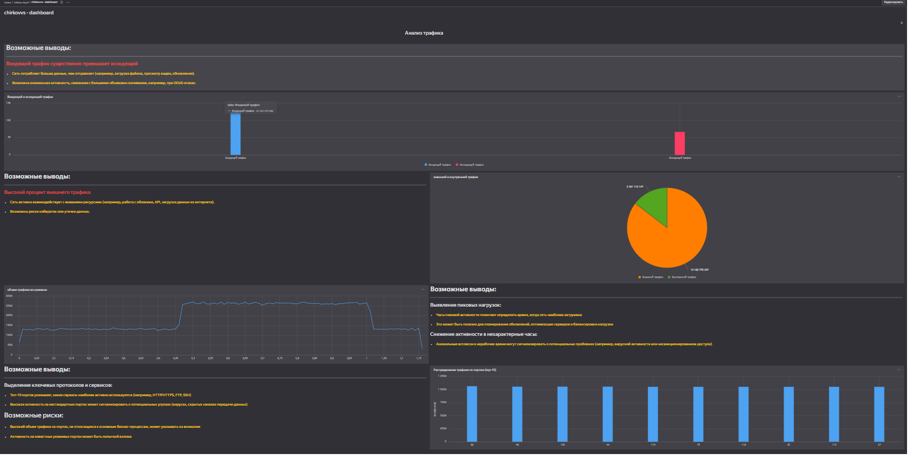

# Использование Yandex DataLens для анализа данных сетевой активности
chirkov.ilya4@yandex.ru

## Цель работы

1.  Изучить возможности технологии Yandex DataLens для визуального
    анализа структурированных наборов данных
2.  Получить навыки визуализации данных для последующего анализа с
    помощью сервисов Yandex Cloud
3.  Получить навыки создания решений мониторинга/SIEM на базе облачных
    продуктов и открытых программных решений
4.  Закрепить практические навыки использования SQL для анализа данных
    сетевой активности в сегментированной корпоративной сети

## Исходные данные

1.  Программное обеспечение Windows 10
2.  Rstudio Desktop и библиотека Dplyr
3.  Интерпретатор языка R 4.1
4.  Сервис Yandex DataLens

## Задачи

1.  Представить в виде круговой диаграммы соотношение внешнего и
    внутреннего сетевого трафика.
2.  Представить в виде столбчатой диаграммы соотношение входящего и
    исходящего трафика из внутреннего сетвого сегмента.
3.  Построить график активности (линейная диаграмма) объема трафика во
    времени.
4.  Все построенные графики вывести в виде единого дашборда в Yandex
    DataLens.

## Ход работы

### Настроить подключение к Yandex Query из DataLens

1.  Перейти в соответствующий сервис – https://datalens.yandex.ru/

    

2.  Выбрать “Подключения” – “Создать новое подключение”

    

3.  Выбрать в разделе “Файлы и сервисы” Yandex Query

    

4.  Настроить и проверить подключение

    

### Создать из запроса YandexQuery датасет DataLens

### Делаем нужные графики, диаграммы и дашборды

1.  Распределение трафика по портам (top-10)

    

2.  Представить в виде круговой диаграммы соотношение внешнего и
    внутреннего сетевого трафика

    

3.  Представить в виде столбчатой диаграммы соотношение входящего и
    исходящего трафика из внутреннего сетвого сегмента.

    

4.  Построить график активности (линейная диаграмма) объема трафика во
    времени.

    

5.  Все построенные графики вывести в виде единого дашборда в Yandex
    DataLens

    Ссылка на дашборд: https://datalens.yandex/0gfuvvrqj1k2n

    

## Оценка результата

В ходе работы были созданы чарты для анализа трафика, освоены
инструменты для обработки и визуализации датасетов в виде удобных чартов
и комплексных дашбордов. Изучены возможности технологии Yandex DataLens
для визуального анализа структурированных наборов данных.Получены навыки
визуализации данных для последующего анализа с помощью сервисов Yandex
Cloud. Получены навыки создания решений мониторинга/SIEM на базе
облачных продуктов и открытых программных решений. Закреплены
практические навыки использования SQL для анализа данных сетевой
активности в сегментированной корпоративной сети

## Вывод

Были получены знания об обработке датасетов на платформе YandexDataLens.
Платформа является удобной для понимания сетевой обстановки и принятия
решений по управлению информационной безопасностью и визуального
представления результатов анализа информации
